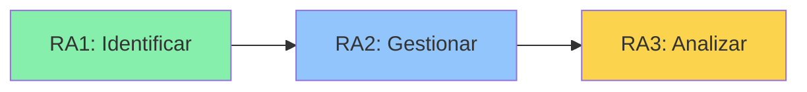

# 🌲 **Ambiente Virtual de Aprendizaje (AVA)**
## *Usos de la Cartografía Básica y Digital en el Sector Forestal*
**Programa:** Tecnología en Protección y Recuperación de Ecosistemas Forestales  
**Modalidad:** Distancia – IDEAD – Universidad del Tolima

### 🧩 Descripción general
Este repositorio forma parte del Ambiente Virtual de Aprendizaje (AVA) del curso **Cartografía Básica y Digital**. Su propósito es integrar los espacios **presenciales y virtuales** para fortalecer las competencias en el uso de la cartografía basica y digital aplicada a la **gestión, restauración y conservación forestal**.

El AVA emplea herramientas de software libre (QGIS, GitHub Pages, y sofware de visualizacion de datos online libres) para fomentar el aprendizaje activo, colaborativo y reflexivo.

### 🎯 Objetivo general
Desarrollar habilidades para interpretar, generar y aplicar mapas temáticos forestales mediante herramientas SIG, fortaleciendo la comprensión espacial y ambiental del territorio.

## Estructura de Competencias y Resultados de Aprendizaje

### 🎯 Competencias del Curso

| Dimensión | Descripción | Resultados Asociados |
|-----------|-------------|---------------------|
| **🌱 SER**   *Afectiva* | Comprende la dimensión espacial y temporal de ecosistemas forestales, desarrollando **compromiso ético** con la gestión sostenible del territorio en proyectos de restauración y conservación. | RA1, RA3 |
| **🧠 SABER**   *Cognitiva* | Domina fundamentos de cartografía digital y SIG, comprendiendo la **relación entre variables biofísicas y socioeconómicas** que determinan la aptitud forestal del territorio colombiano. | RA1, RA2, RA3 |
| **🛠️ HACER**   *Praxiológica* | Aplica técnicas de cartografía y SIG para **producir mapas temáticos forestales**, elaborando análisis espaciales que identifiquen zonas con potencial de restauración y manejo sostenible. | RA1, RA2, RA3 |

### 📚 Resultados de Aprendizaje y Actividades Prácticas

#### 🟢 RA1: Lectura e Interpretación Cartográfica
> **Práctico 1:** Identificación de elementos cartográficos en mapas digitales

**Descripción:** Identifica y describe correctamente los elementos cartográficos fundamentales (escala, proyección, simbología, leyenda, orientación) en mapas digitales forestales.

**📦 Evidencia:** Reporte de análisis de elementos cartográficos con evaluación de calidad

**🔗 Competencias:** SER | SABER | HACER

---

#### 🔵 RA2: Gestión de Datos Geoespaciales Oficiales
> **Práctico 2:** Exploración y descarga de capas geográficas de fuentes oficiales (UPRA)

**Descripción:** Explora, descarga y organiza capas geográficas de fuentes oficiales colombianas (UPRA, IGAC, IDEAM) para análisis geoespacial forestal.

**📦 Evidencia:** Carpeta de datos con metadatos + mapa temático básico

**🔗 Competencias:** SABER | HACER

---

#### 🟡 RA3: Análisis Espacial Integrado con SIG
> **Práctico 3:** Integración de datos y análisis con QGIS/ArcGIS de variables espaciales forestales

**Descripción:** Aplica herramientas SIG (QGIS/ArcGIS) para integrar y analizar variables espaciales relevantes en la gestión forestal mediante geoprocesamiento.

**📦 Evidencia:** Mapa de análisis integrado + documento metodológico

**🔗 Competencias:** SER | SABER | HACER

---

### 📊 Alineación Curricular

| RA | Actividad Práctica | Herramientas/Fuentes | Producto Evaluable |
|----|-------------------|----------------------|-------------------|
| **RA1** | Práctico 1: Identificación de elementos cartográficos | Mapas digitales (AVA, IGAC, IDEAM) | Reporte de análisis comparativo |
| **RA2** | Práctico 2: Exploración y descarga de capas | UPRA, IGAC, IDEAM | Carpeta de datos + mapa temático |
| **RA3** | Práctico 3: Integración y análisis espacial | QGIS, ArcGIS | Mapa de análisis + memoria metodológica |

---

### 🎓 Progresión de Aprendizaje

**Enfoque:** Aprendizaje basado en prácticos secuenciales

 ### 🗂️ Estructura del AVA
| Carpeta | Contenido principal | Objetivo pedagógico |
|---|---|---|
| [`/Documentación`](https://github.com/mabermudezs/Cartografia-Forestal-AVA/tree/main/Documentaci%C3%B3n) | Guías teóricas, lecturas, PDFs y referencias. | Comprensión conceptual. |
| [`/Datos`](https://github.com/mabermudezs/Cartografia-Forestal-AVA/tree/main/Datos) | Capas SIG (.shp, .tif, .csv). | Aplicación práctica. |
| [`/notebooks`](https://github.com/mabermudezs/Cartografia-Forestal-AVA/tree/main/notebooks) | Ejercicios y tutoriales en QGIS o Python. | Desarrollo técnico. |
| [`/media`](https://github.com/mabermudezs/Cartografia-Forestal-AVA/tree/main/media) | Infografías, videos y mapas de apoyo. | Visualización y motivación. |
| [`/evaluation`](https://github.com/mabermudezs/Cartografia-Forestal-AVA/tree/main/Evaluaci%C3%B3n) | Rúbricas y criterios de desempeño. | Evaluación formativa. |

### 💬 Comunicación y colaboración
- **Foros:** *  | [`/*GitHub Discussions*`]([https://github.com/mabermudezs/Cartografia-Forestal-AVA/tree/main/evaluation](https://github.com/mabermudezs/Cartografia-Forestal-AVA/discussions)) |
- **Retroalimentación:** *Issues*  
- **Trabajo colaborativo:** *Pull Requests* y revisiones cruzadas

### 📚 Bibliografía recomendada

Los  documentos mostrados en las ferencias bibliograficas se encuentran dispuestos en [`/Documentación`](https://github.com/mabermudezs/Cartografia-Forestal-AVA/tree/main/Documentaci%C3%B3n)

📕 BIBLIOGRAFÍA BÁSICA OBLIGATORIA
Fundamentos Cartográficos:

Ladino Vargas, H. (2016). Cartografía básica y digital con énfasis en recursos naturales.

Sistemas de Información Geográfica:

Alonso Sarría, F. (2006). Sistemas de información geográfica. Universidad de Murcia, España.
Morales, N. S., Lamaro, A. A., Zucchino, B. I., Torrusio, S. E., & Derguy, M. R. (2025). Introducción a los SIG. Libros de Cátedra.

Teledetección y Aplicaciones Forestales:

Novo Gómez, A., Rodríguez Somoza, J. L., Acuña-Alonso, C., Álvarez Bermúdez, X., & Lorenzo Cimadevila, H. (2021). Teledetección y Sistemas de Información Geográfica en el ámbito forestal.

Caso de Estudio Local:

Pérez Gómez, U., Quimbayo Cardona, M. Á., & Fernández Méndez, F. (2020). Actualización del Plan de Ordenación Forestal del departamento del Tolima (UOF III, IV, V, VII y VIII). Universidad del Tolima & Cortolima.

Aplicaciones Avanzadas:

Villalón Demmer, J. (2025). Caracterización de la severidad de los incendios forestales: caso de estudio en la Sierra de la Culebra (2022). [Doctoral dissertation].

📗 BIBLIOGRAFÍA COMPLEMENTARIA RECOMENDADA
Herramientas Prácticas:

García, A. J. S. (2018). Planificación forestal y gestión territorial, mediante herramientas open source e imágenes de satelites. Universidad de Córdoba.
Rodríguez Carballo, E., & Alfaro Artavia, L. D. (s. f.). Manual de uso del software QGIS. PNUD & AYA.

Geociencias y Variables Ambientales:

Navarro Cerrillo, R. M., González Moreno, P., Varo Martínez, M. Á., & Ariza Salamanca, A. J. (Coords.). (2024). Geociencias aplicadas a la gestión forestal. Máster Geoforest. https://mastergeoforest.es/libro-geoforest/

Aplicaciones Específicas:

Sastre, L. F. S., Marcos-Robles, J. L., Llorente, E. H., Navarro, S. H., & Prieto, P. C. (2016). Aplicación de tecnologías de teledetección al estudio de biomasa forestal. Revista Ibérica de Sistemas e Tecnologias de Informação, (19), 61.
Lekuona Zuazo, I., Lamelas Gracia, M. T., & Montealegre Gracia, A. L. (2017). Cartografía de la biomasa aérea total en masas de Pinus radiata D. Don a partir de datos públicos LIDAR-PNOA e inventario forestal nacional.

Casos Regionales:

Ancira-Sánchez, L., & Treviño Garza, E. J. (2015). Utilización de imágenes de satélite en el manejo forestal del noreste de México. Madera y bosques, 21(1), 77-91.

📘 BIBLIOGRAFÍA OPCIONAL DE CONSULTA
Contexto Nacional Colombiano:

Santos, L., Yepes, A., Rey, C., Guerrero, R., Ruiz, A., & Urrego, D. (2018). Manejo forestal sostenible a través de la forestería comunitaria: una propuesta técnica, institucional y financiera para promover en Colombia. MADS. Programa ONU-REDD.
Instituto Amazónico de Investigaciones Científicas SINCHI. (2014). Zonificación ambiental y ordenamiento de la Reserva Forestal de la Amazonia.

Contexto Global:

González Rojas, C. E. (2020). Tecnología de Información Geoespacial (TIG) para el desarrollo sostenible: Una perspectiva desde la investigación y la docencia.
Conferencia de las Naciones Unidas sobre Comercio y Desarrollo. (2020). Las tecnologías espaciales al servicio del desarrollo sostenible. ONU.

Metodologías Avanzadas:

Díez-Hochleitner Suárez, J. (2022). Aplicación de un espacio reducido a clasificación de imágenes de teledetección: investigación de la deforestación en la zona del Amazonas.
Morán, J. T., Landa, A. F., & Vega, P. R. (2014). Elaboración de cartografía forestal en canarias a partir de datos LIDAR. In Investigación, gestión y técnica forestal, en la región de la Macaronesia (pp. 185-200).

### 🌐 Desarrollo y soporte
**Tutor  responsable:** Miguel Angel Bermudez S.
**Contacto:** mabermudezs@ut.edu.co_  
**Versión:** 1.0 – Noviembre 2025

# Cartografía Forestal AVA

Repositorio del Ambiente Virtual de Aprendizaje (AVA) para materiales, ejercicios y recursos de Cartografía Forestal.

Resumen rápido
- Propósito: centralizar guías, notebooks, datos y materiales multimedia para enseñanza y práctica de cartografía.
- Público objetivo: docentes y estudiantes de cartografía, SIG y teledetección.

Estructura principal (archivos y carpetas clave)
- `README.md` - Esta guía rápida.
- `index.html` - Página principal (lista de acceso rápido). Útil para GitHub Pages.
- `docs/` - Manuales y guías (ej.: `docs/Guia_Cartografia_Forestal.md`).
- `data/` - Conjuntos de datos, ejemplos y `.gitkeep` para mantener la estructura.
- `notebooks/` - Notebooks y material práctico (ej.: `notebooks/geovisores-online/Geovisores_online.md`).
- `media/` - Recursos multimedia: `Videos_geotools.md`, `videos.html`, `videos_enhanced.html`.
- `evaluation/` - Actividades, rúbricas y plantillas de entrega (ej.: `evaluation/Actividades_Aprendizaje.md`).
- `LICENSE` - CC BY-NC-SA 4.0 (licencia del repositorio).
- `.gitignore` - Reglas de exclusión (Python, notebooks, VS Code).
