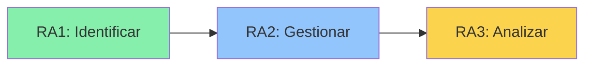

# 🌲 **Ambiente Virtual de Aprendizaje (AVA)**
## *Usos de la Cartografía Básica y Digital en el Sector Forestal*
**Programa:** Tecnología en Protección y Recuperación de Ecosistemas Forestales  
**Modalidad:** Distancia – IDEAD – Universidad del Tolima

 ### 🗂️ Estructura del AVA
| Carpeta | Contenido principal | Objetivo pedagógico |
|---|---|---|
| [`/Documentación`](https://github.com/mabermudezs/Cartografia-Forestal-AVA/tree/main/Documentaci%C3%B3n) | Guías teóricas, lecturas, PDFs y referencias. | Comprensión conceptual. |
| [`/Datos`](https://github.com/mabermudezs/Cartografia-Forestal-AVA/tree/main/Datos) | Capas SIG (.shp, .tif, .csv). | Aplicación práctica. |
| [`/media`](https://github.com/mabermudezs/Cartografia-Forestal-AVA/tree/main/media) | Infografías, videos y mapas de apoyo. | Visualización y motivación. |
| [`/evaluation`](https://github.com/mabermudezs/Cartografia-Forestal-AVA/tree/main/Evaluaci%C3%B3n) | Rúbricas y criterios de desempeño. | Evaluación formativa. |

### 💬 Comunicación 
- **Foros:** *   [`/*GitHub Discussions*`]([https://github.com/mabermudezs/Cartografia-Forestal-AVA/tree/main/evaluation](https://github.com/mabermudezs/Cartografia-Forestal-AVA/discussions)

## Integración de la información geoespacial para la gestión sostenible de recursos forestales

mapa conceptual interactivo  introductorio  que explora la integración de la cartografía básica y digital en la gestión forestal sostenible.

👉 **[🔗 Ver Mapa Interactivo](https://htmlpreview.github.io/?https://github.com/mabermudezs/Cartografia-Forestal-AVA/blob/main/mapa_html_puro.html)**

### 🧩 Descripción general
Este repositorio forma parte del Ambiente Virtual de Aprendizaje (AVA) del curso **Cartografía Básica y Digital**. Su propósito es integrar los espacios **presenciales y virtuales** para fortalecer las competencias en el uso de la cartografía basica y digital aplicada a la **gestión, restauración y conservación forestal**.

El AVA emplea herramientas de software libre (QGIS, GitHub Pages, y sofware de visualizacion de datos online libres) para fomentar el aprendizaje activo, colaborativo y reflexivo.

### 🎯 Objetivo general
Desarrollar habilidades para interpretar, generar y aplicar mapas temáticos forestales mediante herramientas SIG, fortaleciendo la comprensión espacial y ambiental del territorio.

## Estructura de Competencias y Resultados de Aprendizaje

### 🎯 Competencias del Curso

| Dimensión | Descripción | Resultados Asociados |
|-----------|-------------|---------------------|
| **🌱 SER**   *Afectiva* | Comprende la dimensión espacial y temporal de ecosistemas forestales, desarrollando **compromiso ético** con la gestión sostenible del territorio en proyectos de restauración y conservación. | RA1, RA3 |
| **🧠 SABER**   *Cognitiva* | Domina fundamentos de cartografía digital y SIG, comprendiendo la **relación entre variables biofísicas y socioeconómicas** que determinan la aptitud forestal del territorio colombiano. | RA1, RA2, RA3 |
| **🛠️ HACER**   *Praxiológica* | Aplica técnicas de cartografía y SIG para **producir mapas temáticos forestales**, elaborando análisis espaciales que identifiquen zonas con potencial de restauración y manejo sostenible. | RA1, RA2, RA3 |

### 📚 Resultados de Aprendizaje y Actividades Prácticas

#### 🟢 RA1: Lectura e Interpretación Cartográfica
> **Práctico 1:** Identificación de elementos cartográficos en mapas digitales

**Descripción:** Identifica y describe correctamente los elementos cartográficos fundamentales (escala, proyección, simbología, leyenda, orientación) en mapas digitales forestales.

**📦 Evidencia:** Reporte de análisis de elementos cartográficos con evaluación de calidad
[Practico_1](https://github.com/mabermudezs/Cartografia-Forestal-AVA/tree/main/Evaluaci%C3%B3n/Practico_1)

**🔗 Competencias:** SER | SABER | HACER

---

#### 🔵 RA2: Gestión de Datos Geoespaciales Oficiales
> **Práctico 2:** Exploración y descarga de capas geográficas de fuentes oficiales (UPRA)

**Descripción:** Explora, descarga y organiza capas geográficas de fuentes oficiales colombianas (UPRA, IGAC, IDEAM) para análisis geoespacial forestal.

**📦 Evidencia:** Carpeta de datos con metadatos + mapa temático básico

**🔗 Competencias:** SABER | HACER

**Heteroevaluación Prácticos 1 y 2**

**Objetivo:** Evaluar las habilidades del estudiante en la lectura e interpretación de elementos cartográficos y en la gestión de datos geoespaciales oficiales, así como su capacidad para analizar críticamente la calidad y pertinencia de fuentes de información geográfica en el contexto forestal colombiano.

**Método:** Evaluación mediante cuestionario de selección múltiple a través de Google Forms, enfocado en evaluar los conocimientos adquiridos sobre elementos cartográficos fundamentales (escala, proyección, simbología, leyenda, orientación), sistemas de coordenadas, fuentes oficiales de información geoespacial (UPRA, IGAC, IDEAM) y criterios de calidad de datos geográficos aplicados a ecosistemas forestales.

**Criterios de evaluación:**

-Comprensión de Fundamentos Cartográficos: Comprensión de elementos cartográficos y su función en mapas forestales, conocimiento de sistemas de proyección y coordenadas utilizados en Colombia, capacidad para identificar y evaluar la calidad de representaciones cartográficas.
-Gestión de Datos Geoespaciales Oficiales: Habilidad para identificar y acceder a fuentes oficiales colombianas (UPRA, IGAC, IDEAM), comprensión de metadatos y estándares de información geográfica, capacidad para organizar y documentar capas geográficas apropiadamente.
-Análisis Crítico y Aplicación Forestal: Capacidad para evaluar la pertinencia de mapas y datos para gestión forestal, identificación de limitaciones y restricciones de fuentes cartográficas, habilidad para seleccionar información apropiada según escala y propósito de análisis territorial.

RA Evaluados: RA1 (Lectura e interpretación cartográfica) y RA2 (Gestión de datos geoespaciales oficiales)

---

#### 🟡 RA3: Análisis Espacial Integrado con SIG
> **Práctico 3:** Integración de datos y análisis con QGIS/ArcGIS de variables espaciales forestales

**Descripción:** Aplica herramientas SIG (QGIS/ArcGIS) para integrar y analizar variables espaciales relevantes en la gestión forestal mediante geoprocesamiento.

**📦 Evidencia:** Mapa de análisis integrado + documento metodológico

**🔗 Competencias:** SER | SABER | HACER

Coevaluación Práctico 3

Evalúa el desempeño de tus compañeros en el proyecto de análisis espacial integrado, considerando los objetivos establecidos en el presente curso de Cartografía y SIG Aplicado a Gestión Forestal.

**Objetivo:** Fomentar la evaluación crítica y constructiva entre compañeros para mejorar la comprensión colectiva sobre técnicas de geoprocesamiento, integración de variables espaciales y análisis multicriterio aplicados a la zonificación forestal.

**Método:** Presentaciones grupales del mapa de análisis integrado y memoria metodológica, seguidas de sesiones de preguntas y respuestas donde los estudiantes evalúan críticamente el trabajo de sus compañeros, analizando las decisiones metodológicas, la calidad cartográfica y la pertinencia territorial de las propuestas.

**Criterios de evaluación:**

Claridad en la presentación cartográfica: Calidad visual del mapa temático, adecuación de simbología, legibilidad de elementos cartográficos y comunicación efectiva de los resultados del análisis espacial.
Profundidad del análisis metodológico: Fundamentación técnica de las decisiones de geoprocesamiento, justificación de variables seleccionadas, coherencia en la integración de capas geográficas y solidez del análisis multicriterio realizado en QGIS/ArcGIS.
Aplicabilidad y pertinencia forestal: Relevancia del análisis para la gestión forestal del territorio estudiado, viabilidad de las zonas identificadas, consideración del contexto local y calidad de las recomendaciones de manejo propuestas.
Calidad de las respuestas: Capacidad para defender decisiones metodológicas, reconocer limitaciones del análisis, responder técnicamente a cuestionamientos y demostrar comprensión profunda de los procesos SIG aplicados.

Instrucciones: Evalúa a cada grupo usando la siguiente escala para cada criterio:

1: No cumple con las expectativas del práctico (trabajo incompleto, errores significativos, falta de fundamento técnico).
2: Cumple parcialmente con las expectativas del práctico (trabajo básico, algunos errores menores, fundamento técnico limitado).
3: Cumple completamente con las expectativas del práctico (trabajo completo, técnicamente correcto, bien fundamentado).
4: Supera las expectativas del práctico (trabajo excepcional, innovador, análisis profundo y propuestas sólidas).

RA Evaluado: RA3 (Análisis espacial integrado con SIG)

**Autoevaluación Prácticos 1, 2 y 3**

**Objetivo**: Promover la reflexión metacognitiva del estudiante sobre su propio proceso de aprendizaje en cartografía básica y digital, identificando fortalezas, debilidades, retos superados y áreas de mejora en el dominio de técnicas de lectura cartográfica, gestión de datos geoespaciales y análisis espacial con SIG aplicados a la gestión forestal.

**Método:** Cuestionario de autoevaluación individual a través de Google Forms con escala Likert (1-5) que permite al estudiante valorar su nivel de comprensión y dominio en cada uno de los componentes fundamentales trabajados en los tres prácticos, complementado con preguntas abiertas de reflexión sobre retos enfrentados, logros alcanzados y aspectos a fortalecer en su formación geoespacial.

**Criterios de evaluación:**

Comprensión de fundamentos cartográficos: Autovaloración del dominio de elementos cartográficos fundamentales (escala, proyección, simbología, leyenda, orientación), sistemas de coordenadas y capacidad para evaluar críticamente la calidad de mapas forestales digitales.
Gestión de información geoespacial oficial: Autovaloración de la habilidad para acceder, descargar, organizar y documentar capas geográficas de fuentes oficiales colombianas (UPRA, IGAC, IDEAM), así como el manejo de metadatos y formatos de datos geoespaciales.
Competencia técnica en SIG: Autovaloración del dominio en el uso de software especializado (QGIS/ArcGIS) para ejecutar técnicas de geoprocesamiento, integrar variables espaciales y realizar análisis multicriterio para zonificación forestal.
Capacidad de análisis e interpretación: Autovaloración de la habilidad para interpretar resultados de análisis espaciales, identificar zonas con potencial forestal, fundamentar decisiones territoriales y producir mapas temáticos con calidad profesional.
Reflexión crítica y metacognición: Capacidad para identificar con honestidad los principales retos enfrentados durante la unidad, reconocer fortalezas consolidadas y detectar áreas específicas que requieren refuerzo o práctica adicional para mejorar el desempeño profesional.

Escala de valoración:

1: Mínimo entendimiento
2: Bajo entendimiento
3: Entendimiento moderado
4: Buen entendimiento
5: Excelente dominio

RA Evaluados: RA1 (Lectura e interpretación cartográfica), RA2 (Gestión de datos geoespaciales oficiales) y RA3 (Análisis espacial integrado con SIG)

---

### 📊 Alineación Curricular

| RA | Actividad Práctica | Herramientas/Fuentes | Producto Evaluable |
|----|-------------------|----------------------|-------------------|
| **RA1** | Práctico 1: Identificación de elementos cartográficos | Mapas digitales (AVA, IGAC, IDEAM) | Reporte de análisis comparativo |
| **RA2** | Práctico 2: Exploración y descarga de capas | UPRA, IGAC, IDEAM | Carpeta de datos + mapa temático |
| **RA3** | Práctico 3: Integración y análisis espacial | QGIS, ArcGIS | Mapa de análisis + memoria metodológica |

---

### 🎓 Progresión de Aprendizaje

```mermaid
graph LR
    A[RA1: Identificar] --> B[RA2: Gestionar]
    B --> C[RA3: Analizar]
    
    style A fill:#86efac
    style B fill:#93c5fd
    style C fill:#fcd34d
```

**Enfoque:** Aprendizaje basado en prácticos secuenciales

### 📚 Bibliografía recomendada

Los  documentos mostrados en las ferencias bibliograficas se encuentran dispuestos en [`/Documentación`](https://github.com/mabermudezs/Cartografia-Forestal-AVA/tree/main/Documentaci%C3%B3n)  tener en cuenta que se encuentran dispuesos en orden alfabetico por nombre junto año de publicacion

📕 BIBLIOGRAFÍA BÁSICA OBLIGATORIA
Fundamentos Cartográficos:

Ladino Vargas, H. (2016). Cartografía básica y digital con énfasis en recursos naturales.

Sistemas de Información Geográfica:

Alonso Sarría, F. (2006). Sistemas de información geográfica. Universidad de Murcia, España.
Morales, N. S., Lamaro, A. A., Zucchino, B. I., Torrusio, S. E., & Derguy, M. R. (2025). Introducción a los SIG. Libros de Cátedra.

Manual de herramientas SIG (Qgis)

Rodríguez Carballo, E., & Alfaro Artavia, L. D. (s. f.). Manual de uso del software QGIS. Programa de las Naciones Unidas para el Desarrollo (PNUD) & Instituto Costarricense de Acueductos y Alcantarillados (AYA).

Caso de Estudio Local:

Pérez Gómez, U., Quimbayo Cardona, M. Á., & Fernández Méndez, F. (2020). Actualización del Plan de Ordenación Forestal del departamento del Tolima (UOF III, IV, V, VII y VIII). Universidad del Tolima & Cortolima.

Aplicaciones Avanzadas:

Villalón Demmer, J. (2025). Caracterización de la severidad de los incendios forestales: caso de estudio en la Sierra de la Culebra (2022). [Doctoral dissertation].

📗 BIBLIOGRAFÍA COMPLEMENTARIA RECOMENDADA
Herramientas Prácticas:

García, A. J. S. (2018). Planificación forestal y gestión territorial, mediante herramientas open source e imágenes de satelites. Universidad de Córdoba.
Rodríguez Carballo, E., & Alfaro Artavia, L. D. (s. f.). Manual de uso del software QGIS. PNUD & AYA.

Geociencias y Variables Ambientales:

Navarro Cerrillo, R. M., González Moreno, P., Varo Martínez, M. Á., & Ariza Salamanca, A. J. (Coords.). (2024). Geociencias aplicadas a la gestión forestal. Máster Geoforest. https://mastergeoforest.es/libro-geoforest/

Aplicaciones Específicas:

Sastre, L. F. S., Marcos-Robles, J. L., Llorente, E. H., Navarro, S. H., & Prieto, P. C. (2016). Aplicación de tecnologías de teledetección al estudio de biomasa forestal. Revista Ibérica de Sistemas e Tecnologias de Informação, (19), 61.
Lekuona Zuazo, I., Lamelas Gracia, M. T., & Montealegre Gracia, A. L. (2017). Cartografía de la biomasa aérea total en masas de Pinus radiata D. Don a partir de datos públicos LIDAR-PNOA e inventario forestal nacional.

Casos Regionales:

Ancira-Sánchez, L., & Treviño Garza, E. J. (2015). Utilización de imágenes de satélite en el manejo forestal del noreste de México. Madera y bosques, 21(1), 77-91.

📘 BIBLIOGRAFÍA OPCIONAL DE CONSULTA
Contexto Nacional Colombiano:

Santos, L., Yepes, A., Rey, C., Guerrero, R., Ruiz, A., & Urrego, D. (2018). Manejo forestal sostenible a través de la forestería comunitaria: una propuesta técnica, institucional y financiera para promover en Colombia. MADS. Programa ONU-REDD.
Instituto Amazónico de Investigaciones Científicas SINCHI. (2014). Zonificación ambiental y ordenamiento de la Reserva Forestal de la Amazonia.

Contexto Global:

González Rojas, C. E. (2020). Tecnología de Información Geoespacial (TIG) para el desarrollo sostenible: Una perspectiva desde la investigación y la docencia.
Conferencia de las Naciones Unidas sobre Comercio y Desarrollo. (2020). Las tecnologías espaciales al servicio del desarrollo sostenible. ONU.

Metodologías Avanzadas:

Díez-Hochleitner Suárez, J. (2022). Aplicación de un espacio reducido a clasificación de imágenes de teledetección: investigación de la deforestación en la zona del Amazonas.
Morán, J. T., Landa, A. F., & Vega, P. R. (2014). Elaboración de cartografía forestal en canarias a partir de datos LIDAR. In Investigación, gestión y técnica forestal, en la región de la Macaronesia (pp. 185-200).

### 🌐 Desarrollo y soporte
**Tutor  responsable:** Miguel Angel Bermudez S.
**Contacto:** mabermudezs@ut.edu.co_  
**Versión:** 1.0 – Noviembre 2025

# Cartografía Forestal AVA

Repositorio del Ambiente Virtual de Aprendizaje (AVA) para materiales, ejercicios y recursos de Cartografía Forestal.

Resumen rápido
- Propósito: centralizar guías, notebooks, datos y materiales multimedia para enseñanza y práctica de cartografía.
- Público objetivo: docentes y estudiantes de cartografía, SIG y teledetección.

Estructura principal (archivos y carpetas clave)
- `README.md` - Esta guía rápida.
- `index.html` - Página principal (lista de acceso rápido). Útil para GitHub Pages.
- `docs/` - Manuales y guías (ej.: `docs/Guia_Cartografia_Forestal.md`).
- `data/` - Conjuntos de datos, ejemplos y `.gitkeep` para mantener la estructura.
- `notebooks/` - Notebooks y material práctico (ej.: `notebooks/geovisores-online/Geovisores_online.md`).
- `media/` - Recursos multimedia: `Videos_geotools.md`, `videos.html`, `videos_enhanced.html`.
- `evaluation/` - Actividades, rúbricas y plantillas de entrega (ej.: `evaluation/Actividades_Aprendizaje.md`).
- `LICENSE` - CC BY-NC-SA 4.0 (licencia del repositorio).
- `.gitignore` - Reglas de exclusión (Python, notebooks, VS Code).
